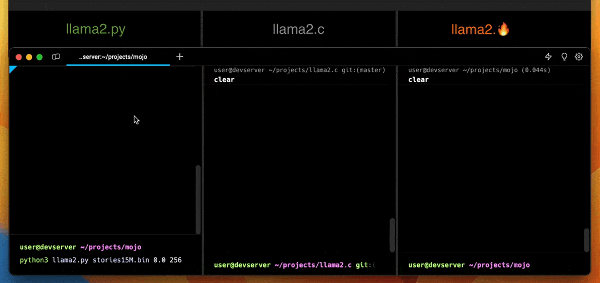

## llama2.🔥

<p align="center">
  
</p>

Have you ever wanted to inference a baby Llama 2 model in pure Mojo? No? Well, now you can!

supported version: [Mojo 0.4.0](https://docs.modular.com/mojo/changelog.html#v0.4.0-2023-10-05)

With the release of [Mojo](https://www.modular.com/blog/mojo-its-finally-here), I was inspired to take my Python port
of [llama2.py](https://github.com/tairov/llama2.py) and transition it to Mojo. The result? A version that leverages
Mojo's SIMD & vectorization primitives, boosting the Python performance by nearly 250x. Impressively, the Mojo version
now outperforms the original `llama2.c` compiled in `runfast` mode out of the box by 15-20%.
This showcases the potential of hardware-level optimizations through Mojo's advanced features.
I think this also can help us to see how far can we go with the original `llama2.c` hardware optimizations.

## performance

Since there were some debates was this comparison legit or not I did some research and found that in `runfast`
mode `llama2.c`
includes multiple optimizations like aggressive vectorization, which makes comparison fair with Mojo SIMD vectorization.

UPD. further improvements of `llama2.mojo` parallelization make it working slightly better or the same as C on different models.

## supported models

At the moment, the following models were successfully executed via `llama2.mojo`:

| Model                    |
|--------------------------|
| stories 260K, 15M, 110M  |
| Tinyllama-1.1B-Chat-v0.2 |

### extensive benchmark on Apple M1 Max

[mojo vs 6 programming languages](https://engiware.com/benchmark/llama2-ports-extensive-benchmarks-mac-m1-max.html)

### benchmark (updated)

| Model           | [llama2.c](https://github.com/karpathy/llama2.c) (OMP/parallelized) | **llama2.mojo** (parallelized) | llama2.mojo (naive matmul) | [llama2.py](https://github.com/tairov/llama2.py) |
|-----------------|---------------------------------------------------------------------|--------------------------------|----------------------------|--------------------------------------------------|
| stories15M.bin  | 435 tok/s                                                           | 440 tok/s                      | 67.26 tok/s                | 1.3 tok/s                                        | 
| stories110M.bin | 64 tok/s                                                            | 63 tok/s                       | 9.20 tok/s                 | -                                                | 
| TinyLlama-1.1B  | 7.25 tok/s                                                          | 7.25 tok/s                      | -                          | -                                                | 

#### OS/HW specs

```
OS:         Ubuntu 20.04
CPU(s):     6
Model name: Intel(R) Core(TM) i7-8700 CPU @ 3.20GHz
CPU MHz:    3191.998
```

## prerequisites

Make sure you have installed
and [configured mojo on your environment](https://docs.modular.com/mojo/manual/get-started/index.html)

Or you can use [mojo playground](https://playground.modular.com/) to run this model.

## try the 🔥 magic
HuggingFace - https://huggingface.co/spaces/radames/Gradio-llama2.mojo

## feel the 🔥 magic

First, navigate to the folder when you keep your projects and clone this repository to this folder:

```bash
git clone https://github.com/tairov/llama2.mojo.git
```

Then, open the repository folder:

```bash
cd llama2.mojo
```

Now, let's download the model

```bash
wget https://huggingface.co/karpathy/tinyllamas/resolve/main/stories15M.bin
```

Then, just run the Mojo

```bash
mojo llama2.mojo stories15M.bin -s 100 -n 256 -t 0.5 -i "Mojo is a language"
```

**example output**

```
num hardware threads:  6
SIMD vector width:  16
checkpoint size:  60816028 [ 57 MB ]
n layers:  6
vocab size:  32000
Mojo is a language that people like to talk. Hephones are very different from other people. He has a big book with many pictures and words. He likes to look at the pictures and learn new things.
One day, Mojo was playing with his friends in the park. They were running and laughing and having fun. Mojo told them about his book and his friends. They listened and looked at the pictures. Then, they saw a picture of a big, scary monster. They were very scared and ran away.
Mojo was sad that his book was gone. He told his friends about the monster and they all felt very sad. Mojo's friends tried to make him feel better, but nothing worked. Mojo never learned his language again.
achieved tok/s:  440.21739130434781
```

## running via Docker

```bash
docker build --build-arg AUTH_KEY=<your-modular-auth-key> -t llama2.mojo .
docker run -it llama2.mojo
```

With Gradio UI:

```bash
# uncomment the last line in Dockerfile CMD ["python", "gradio_app.py"]
docker run -it -p 0.0.0.0:7860:7860 llama2.mojo
``` 

## citing llama2.🔥

If you use or discuss llama2.mojo in your academic research, please cite the project to help spread awareness:

```
@misc{llama2.mojo,
  author = {Aydyn Tairov}, 
  title = {Inference Llama2 in one file of pure Mojo},
  year = {2023},
  month = {09},
  howpublished = {\url{https://github.com/tairov/llama2.mojo}},
  note = {Llama2 Mojo, MIT License}
}
```

We kindly request that you include a link to the GitHub repository in published papers. This will allow interested
readers to easily find the latest updates and extensions to the project.

`llama2.mojo` aims to encourage academic research on efficient implementations of transformer architectures, the `llama`
model, and applications of the `mojo` programming language. Citing the project helps growth of the knowledge community
around these topics. We appreciate your support through referencing `llama2.mojo`!

## play with Tinyllama-1.1B-Chat-v0.2

The [TinyLlama](https://github.com/jzhang38/TinyLlama) is a 1.1B Llama model trained on 3 trillion tokens. This
compactness allows it to cater to a multitude of applications demanding a restricted computation and memory footprint.
This is also the reason why we select it as the first model to support.

First, navigate to the folder when you keep your projects and clone this repository to this folder:

```bash
git clone https://github.com/tairov/llama2.mojo.git
```

Then, open the repository folder:

```bash
cd llama2.mojo
```

Now, let's download the model and the tokenizer

```bash
wget https://huggingface.co/kirp/TinyLlama-1.1B-Chat-v0.2-bin/resolve/main/tok_tl-chat.bin
wget https://huggingface.co/kirp/TinyLlama-1.1B-Chat-v0.2-bin/resolve/main/tl-chat.bin
```

Then, just run the Mojo

```bash
mojo llama2.mojo tl-chat.bin \
    -z tok_tl-chat.bin \
    -n 256 -t 0 -s 100 -i "<|im_start|>user\nGive me a python function to generate Fibonacci sequence<|im_end|>\n<|im_start|>assistant\n"
```

**example output**

```
num hardware threads:  6
SIMD vector width:  16
checkpoint size:  4400767004 [ 4196 MB ]
n layers:  22
vocab size:  32003
<|im_start|>user
Give me a python function to generate Fibonacci sequence<|im_end|>
<|im_start|>assistant
Sure, here's a Python function that generates the Fibonacci sequence:

def fibonacci(n):
    if n <= 0:
        return 0
    elif n == 1:
        return 1
    else:
        return fibonacci(n-1) + fibonacci(n-2)

This function takes an integer n as a parameter and returns the next Fibonacci number. It uses a recursive approach to calculate the Fibonacci numbers, starting from 0 and working up. The function returns the value it found at the current level of the recursion, which can be either 0 or a Fibonacci number.
```

## license

MIT
