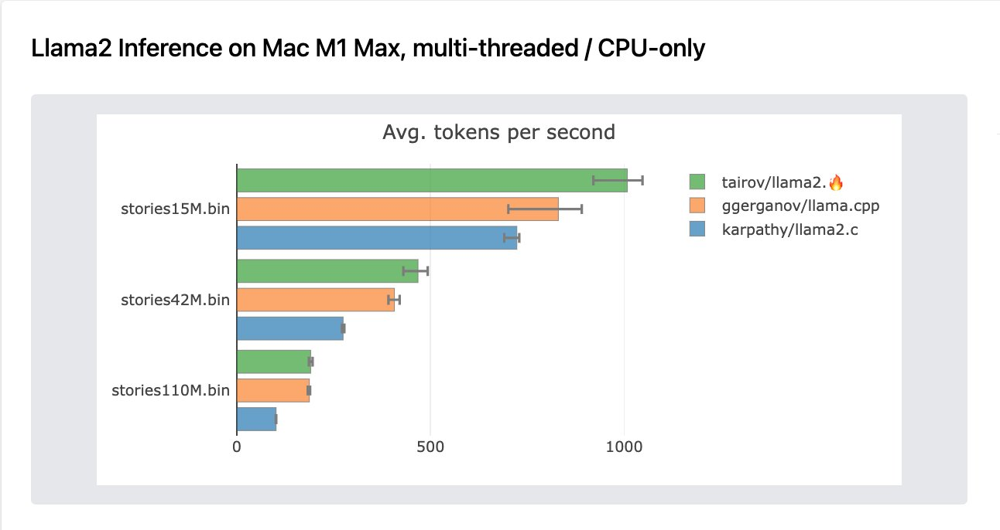

## llama2.🔥

<p align="center">
  
</p>

Have you ever wanted to inference a baby Llama 2 model in pure Mojo? No? Well, now you can!

**supported version**: [Mojo 0.25.7.0](https://docs.modular.com/mojo/changelog/#v0257-nightly)


With the release of [Mojo](https://www.modular.com/blog/mojo-its-finally-here), I was inspired to take my Python port
of [llama2.py](https://github.com/tairov/llama2.py) and transition it to Mojo. The result? A version that leverages
Mojo's SIMD & vectorization primitives, boosting the Python performance by nearly 250x. 
Impressively, after few native improvements the Mojo version outperforms the original `llama2.c` by 30% in multi-threaded inference. As well as it outperforms `llama.cpp` on baby-llama inference on CPU by 20%.
This showcases the potential of hardware-level optimizations through Mojo's advanced features.

## supported models

At the moment, the following models were successfully executed via `llama2.mojo`:

| Models                       |
|------------------------------|
| stories 260K, 15M, 42M, 110M |
| Tinyllama-1.1B-Chat-v0.2     |

### extensive benchmark on Apple M1 Max

[mojo vs 6 programming languages](https://engiware.com/benchmark/llama2-ports-extensive-benchmarks-mac-m1-max.html)

### benchmark (updated)

**Mac M1 Max (6 threads)**

| Model           | [llama2.c](https://github.com/karpathy/llama2.c) (OMP/parallelized) | **llama2.mojo** (parallelized) | llama.cpp (CPU, 6 threads) | [llama2.py](https://github.com/tairov/llama2.py) |
|-----------------|---------------------------------------------------------------------|--------------------------------|-----------------|--------------------------------------------------|
| stories15M.bin  | 730 tok/s                                                           | 1025 tok/s                     | 890 tok/s       | 38 tok/s (pypi)                                  | 
| stories42M.bin  | 270 tok/s                                                           | 490 tok/s                      | 420 tok/s       | -                                                | 
| stories110M.bin | 102 tok/s                                                           | 195 tok/s                      | 187 tok/s       | -                                                | 
| TinyLlama-1.1B  | -                                                                   | 23 tok/s                       | -               | -                                                | 

**Ubuntu 20.04, Intel(R) Core(TM) i7-8700 CPU @ 3.20GHz, 6 cores, 12 threads**

| Model           | [llama2.c](https://github.com/karpathy/llama2.c) (OMP/parallelized) | **llama2.mojo** (parallelized) | llama2.mojo (naive matmul) | [llama2.py](https://github.com/tairov/llama2.py) |
|-----------------|---------------------------------------------------------------------|--------------------------------|----------------------------|--------------------------------------------------|
| stories15M.bin  | 435 tok/s                                                           | 440 tok/s                      | 67.26 tok/s                | 1.3 tok/s                                        | 
| stories110M.bin | 64 tok/s                                                            | 63 tok/s                       | 9.20 tok/s                 | -                                                | 
| TinyLlama-1.1B  | 7.25 tok/s                                                          | 7.25 tok/s                     | -                          | -                                                | 

## prerequisites

Make sure you have installed
and [configured mojo on your environment](https://docs.modular.com/mojo/manual/get-started/index.html)


## feel the 🔥 magic

First, navigate to the folder when you keep your projects and clone this repository to this folder:

```bash
git clone https://github.com/tairov/llama2.mojo.git
```

Then, open the repository folder:

```bash
cd llama2.mojo
```

Now, let's download the model

```bash
wget https://huggingface.co/karpathy/tinyllamas/resolve/main/stories15M.bin
```

Then, just run the Mojo

```bash
mojo llama2.mojo stories15M.bin -s 100 -n 256 -t 0.5 -i "Once upon a time"
```

**Command-line options:**

- `-s <int>` - random seed (default: current time in milliseconds)
- `-n <int>` - number of steps to run for (default: 256, 0 = max_seq_len)
- `-t <float>` - temperature in [0,1.0] (default: 0.9)
- `-i <string>` - input prompt
- `-z <string>` - tokenizer path (default: tokenizer.bin)
- `-j <int>` - number of parallel workers (default: number of performance cores)
- `-pc <int>` - print config (0 or 1)

**example output**

```
num parallel workers: 4  SIMD width: 16
Total bytes read: 60816028 Estimated checkpoint size:  57 MB
n layers: 6 | vocab size: 32000
Once upon a time, there was a little girl named Lily. She loved to play with her toys and her friends. One day, Lily's mom asked her to help make dinner. Lily was happy to help and got out the plates and forks.
While they were cooking, Lily's mom asked her to help clean the kitchen. Lily was happy to help and started to pick up the plates. Suddenly, she saw a shiny knife on the counter. She picked it up and showed it to her mom.
"Be careful with that knife, Lily. It's sharp and can hurt you," her mom warned.
Lily was careful and put the knife away. She finished cooking and felt proud of herself. Her mom hugged her and said, "You are such a good helper, Lily. Thank you for helping me."
achieved tok/s:  148.95267649340573
```

## citing llama2.🔥

If you use or discuss llama2.mojo in your academic research, please cite the project to help spread awareness:

```
@misc{llama2.mojo,
  author = {Aydyn Tairov}, 
  title = {Inference Llama2 in one file of pure Mojo},
  year = {2023},
  month = {09},
  howpublished = {\url{https://github.com/tairov/llama2.mojo}},
  note = {Llama2 Mojo, MIT License}
}
```

We kindly request that you include a link to the GitHub repository in published papers. This will allow interested
readers to easily find the latest updates and extensions to the project.

`llama2.mojo` aims to encourage academic research on efficient implementations of transformer architectures, the `llama`
model, and applications of the `mojo` programming language. Citing the project helps growth of the knowledge community
around these topics. We appreciate your support through referencing `llama2.mojo`!

## in research & industry

Our project has been used in academic. If you’ve published a paper or article that uses this project, please send a PR, so we can feature it here
* https://arxiv.org/abs/2410.17736 - MojoBench: Language Modeling and Benchmarks for Mojo
* https://arxiv.org/abs/2505.04080 - MojoFrame: Dataframe Library in Mojo Language
* https://ieeexplore.ieee.org/abstract/document/10883176/metrics - A Comprehensive Review of Mojo: A High-Performance Programming Language
* https://arxiv.org/abs/2502.01651 - Fine-tuning LLaMA 2 interference: a comparative study of language implementations for optimal efficiency


## play with Tinyllama-1.1B-Chat-v0.2

The [TinyLlama](https://github.com/jzhang38/TinyLlama) is a 1.1B Llama model trained on 3 trillion tokens. This
compactness allows it to cater to a multitude of applications demanding a restricted computation and memory footprint.
This is also the reason why we select it as the first model to support.

First, navigate to the folder when you keep your projects and clone this repository to this folder:

```bash
git clone https://github.com/tairov/llama2.mojo.git
```

Then, open the repository folder:

```bash
cd llama2.mojo
```

Now, let's download the model and the tokenizer

```bash
wget https://huggingface.co/kirp/TinyLlama-1.1B-Chat-v0.2-bin/resolve/main/tok_tl-chat.bin
wget https://huggingface.co/kirp/TinyLlama-1.1B-Chat-v0.2-bin/resolve/main/tl-chat.bin
```

Then, just run the Mojo

```bash
mojo llama2.mojo tl-chat.bin \
    -z tok_tl-chat.bin \
    -n 256 -t 0 -s 100 -i "<|im_start|>user\nGive me a python function to generate Fibonacci sequence<|im_end|>\n<|im_start|>assistant\n"
```

**example output**

```
num hardware threads:  6
SIMD vector width:  16
checkpoint size:  4400767004 [ 4196 MB ]
n layers:  22
vocab size:  32003
<|im_start|>user
Give me a python function to generate Fibonacci sequence<|im_end|>
<|im_start|>assistant
Sure, here's a Python function that generates the Fibonacci sequence:

def fibonacci(n):
    if n <= 0:
        return 0
    elif n == 1:
        return 1
    else:
        return fibonacci(n-1) + fibonacci(n-2)

This function takes an integer n as a parameter and returns the next Fibonacci number. It uses a recursive approach to calculate the Fibonacci numbers, starting from 0 and working up. The function returns the value it found at the current level of the recursion, which can be either 0 or a Fibonacci number.
```

## license

MIT


